# Twilight WAF AI — Diagram Suite

Professional palette reference:
- Deep Navy `#0B1F2A` (frames/background accents)
- Steel Gray `#2F3C48` (infrastructure layers)
- Teal Accent `#00A8B5` (data/control flows)
- Amber `#F5A623` (latency/alerts)
- Soft Neutral `#E5E9EC` / White `#FDFDFD` (text panels)

All diagrams below use quoted labels and ` ` line breaks so they render reliably in GitHub Markdown.

---

## 1. System Architecture (Services & Flows)

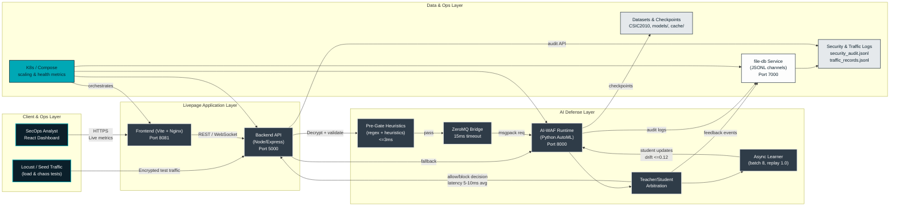

### Architecture Metrics & Guarantees
- **Latency budget:** pre-gate ≤3ms, ML path ≤10ms avg, worst-case ≤40ms.
- **Throughput target:** >200 req/s per AI runtime; horizontally scale via Compose/K8s replicas.
- **Accuracy gate:** ≥85% global on holdout; false negatives <5%.
- **Reliability levers:** ZeroMQ retry → HTTP fallback, async learner isolated from hot path, file-db append-only with health probes.

---

## 2. UML Diagrams

### 2.1 Use-Case Overview
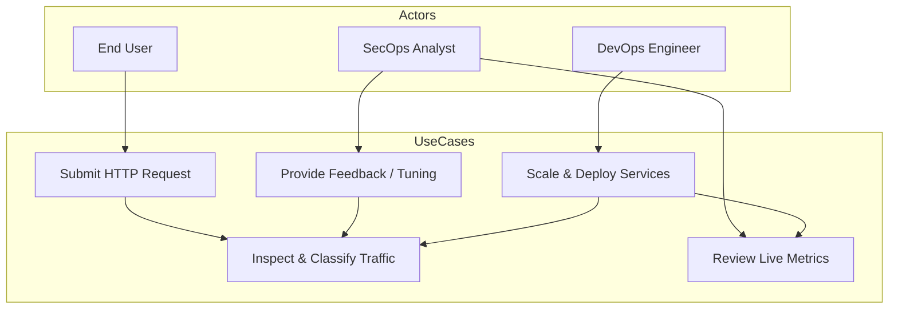

### 2.2 Sequence Diagram — Request Inspection & Feedback Loop
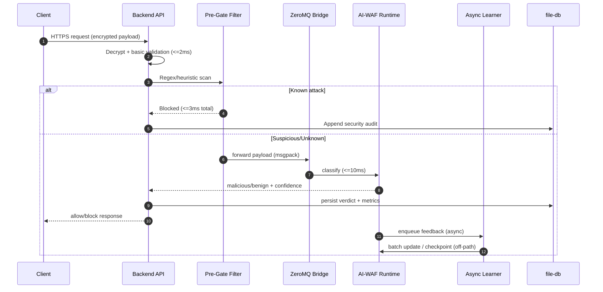

### 2.3 Component/Class Diagram (High-Level)
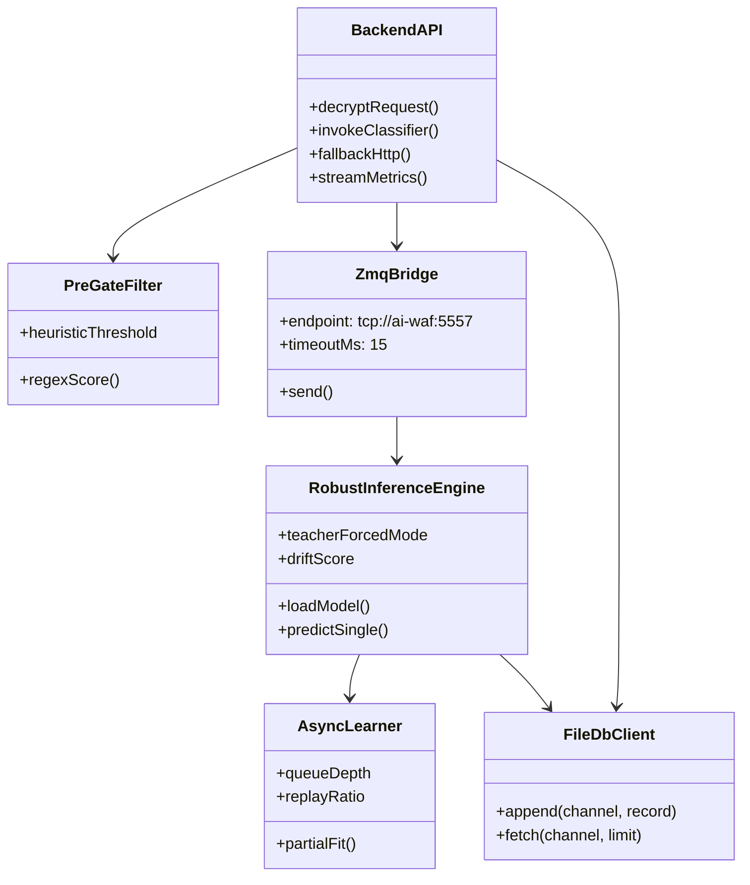

---

## 3. ML & MLOps Diagrams

### 3.1 Training & Deployment Lifecycle
```mermaid
flowchart LR
  classDef stage fill:#2F3C48,stroke:#E5E9EC,color:#FDFDFD,stroke-width:1.5;
  classDef metric fill:#F5A623,stroke:#0B1F2A,color:#0B1F2A,stroke-width:1.5;

  DS["Datasets<br/>CSIC2010 + huggingface"]
  FE["Feature Extraction<br/>TF-IDF + stats"]
  ALBL["Attack Labeler<br/>18 OWASP classes"]
  AUTO["AutoML Training<br/>auto-sklearn / AutoKeras"]
  EVAL["Evaluation Suite<br/>F1, ROC, drift"]
  PKG["Model Packaging<br/>.joblib / SavedModel"]
  DEP["Runtime Deploy<br/>AI-WAF container"]
  MON["Monitoring<br/>metrics_v1.json"]

  DS --> ALBL --> FE --> AUTO --> EVAL --> PKG --> DEP --> MON
  MON -->|accuracy ≥85%?| DEP
  EVAL -.->|fail gate| AUTO
  class DS,FE,ALBL,AUTO,EVAL,PKG,DEP,MON stage;
```

### 3.2 Online Learning & Drift Control
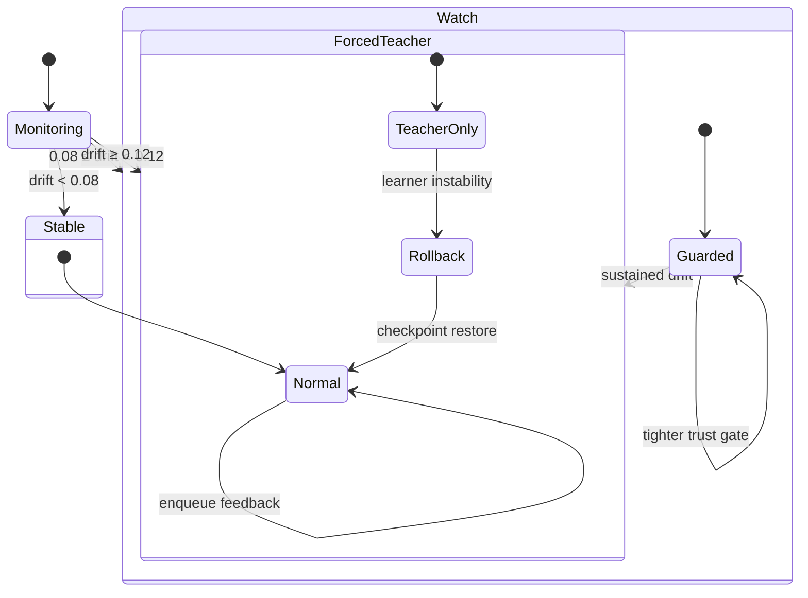

---

## 4. DataOps & Dataflow

### 4.1 End-to-End Dataflow
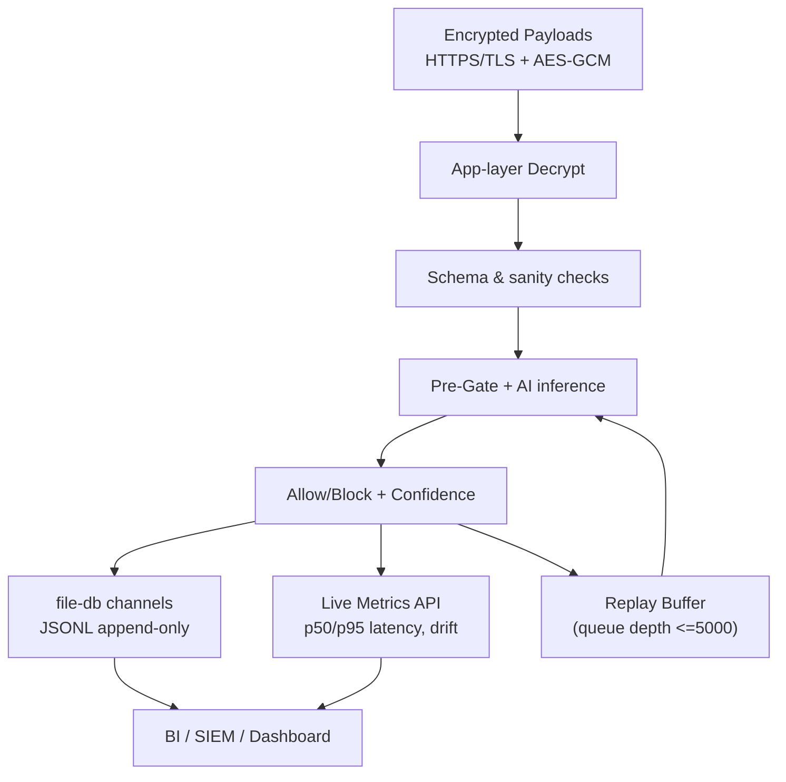

### 4.2 Data Reliability & Governance Controls
- **Encryption:** TLS in transit + AES-256-GCM envelope for payload body.
- **Storage:** Append-only `.jsonl` with host bind mounts; backups via Git-ignored `file-db/data` snapshots.
- **Retention knobs:** rotate by file size/time; export to SIEM for immutable retention.
- **Reliability hooks:** health checks (`/health`, `/records`), idempotent sync batches, jitter + exponential backoff for coordination.
- **Observability metrics:** learner queue depth, drift score, teacher forced flag, replay acceptance, log write latency.

---

## 5. Quality Attribute Annotations
- **Scalability:** horizontal scaling at backend, AI runtime, and file-db tiers; ZeroMQ endpoint pool + Kubernetes HPA for sustained >10k req/s.
- **Reliability:** teacher/learner arbitration, automatic rollback, dual-transport (ZMQ + HTTP) path, append-only logging, trust gate preventing poisoning.
- **Latency:** strict budgets per stage with monitoring hooks; diagrams note ≤3ms pre-gate, ≤10ms inference, ≤1ms enqueue.
- **Performance:** async learning off hot path, replay buffer to avoid catastrophic forgetting, Locust-based load tests to validate KPIs.

> Render each Mermaid block to SVG/PNG with a consistent canvas size (minimum width 1200px) to preserve spacing and prevent label overlap.

---

## 6. Security & Trust Controls

### 6.1 Threat Intake & Trust Pipeline
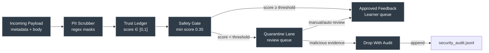

### 6.2 Trust Score Evolution (Example Source)
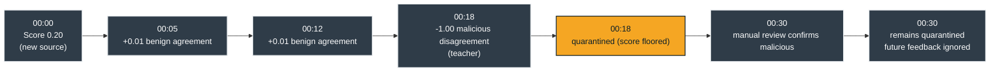

---

## 7. Sync & Deployment Operations

### 7.1 Sync Coordinator Sequence
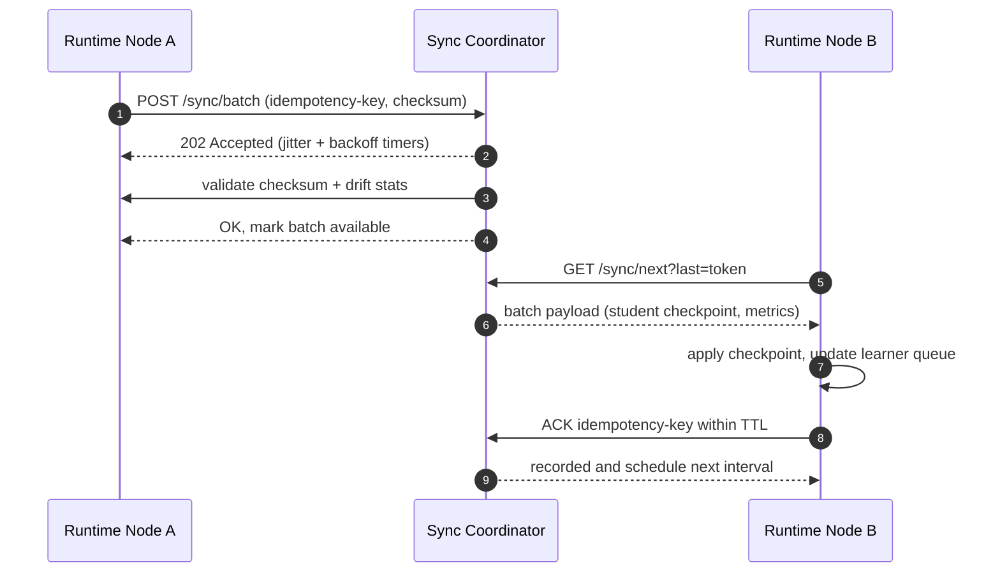

### 7.2 Deployment Footprint
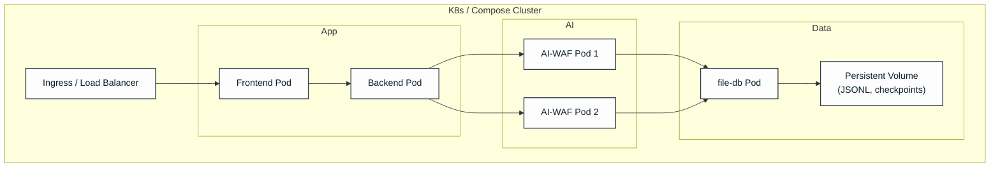

---

## 8. Encryption & Transport Detail

### 8.1 Envelope Encryption Lifecycle
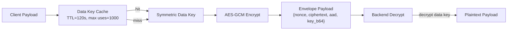

### 8.2 Transport Fallback Logic
```mermaid
stateDiagram-v2
  [*] --> ZMQPrimary
  ZMQPrimary --> ZMQPrimary : response < timeout (15ms)
  ZMQPrimary --> HTTPFallback : timeout or socket error
  HTTPFallback --> HTTPFallback : retry attempts ≤ 3
  HTTPFallback --> Failure : retries exhausted
  HTTPFallback --> ZMQPrimary : success; resume primary path
```

---

## 9. Load Testing & Observability Flows

### 9.1 Locust Test Pipeline
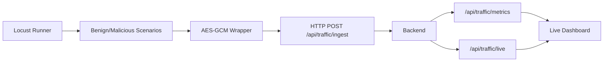

### 9.2 Metrics & Alert Streams
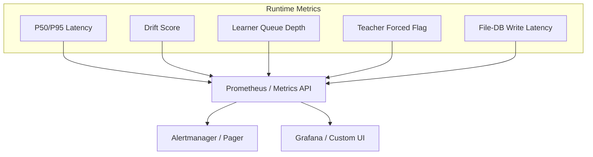

---

All additional diagrams follow the same palette and grid layout rules. Ensure exports maintain multi-line labels to prevent overlap when embedding in documentation or slide decks.

---

## 10. Incident Response & Rollback Flow

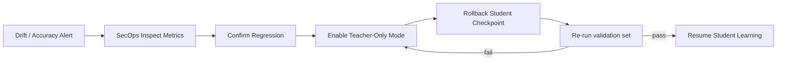

---

## 11. User Journey (SecOps Dashboard)

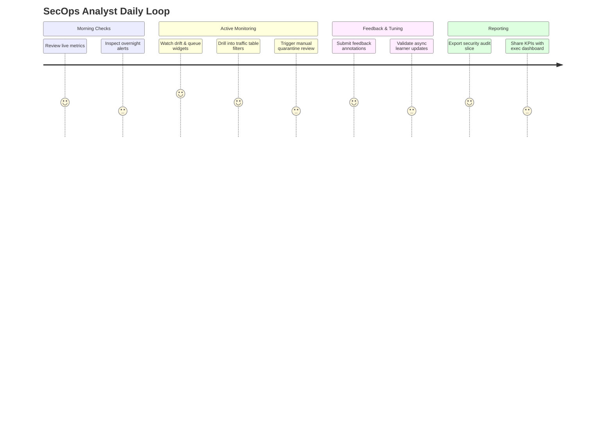

---

## 12. Automated MLOps Pipeline (CI/CD)

```mermaid
flowchart LR
  classDef stage fill:#2F3C48,stroke:#E5E9EC,color:#FDFDFD,stroke-width:1.5;
  classDef gate fill:#F5A623,stroke:#0B1F2A,color:#0B1F2A,stroke-width:1.5;

  Commit["Git Commit<br/>(model/config change)"]
  CI["CI Job<br/>pytest + lint"]
  Train["Automated Training Job<br/>GPU runner"]
  Bench["Benchmark Stage<br/>latency + accuracy gates"]
  Package["Container Build<br/>model + service"]
  Canary["Canary Deploy<br/>1 replica"]
  Observe["Observe metrics<br/>24h"]
  Rollout["Full rollout"]

  Commit --> CI --> Train --> Bench --> Package --> Canary --> Observe --> Rollout
  Bench -->|gate fail| Train
  Observe -->|metrics drop| Canary
```

---

## 13. Storage Lifecycle & Governance

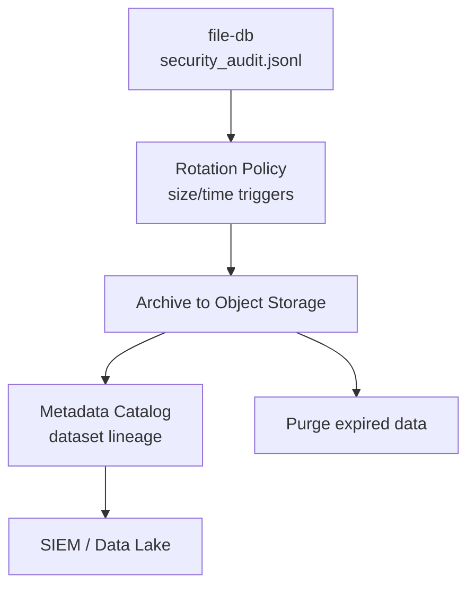

---

## 14. Capability Roadmap (High-Level)

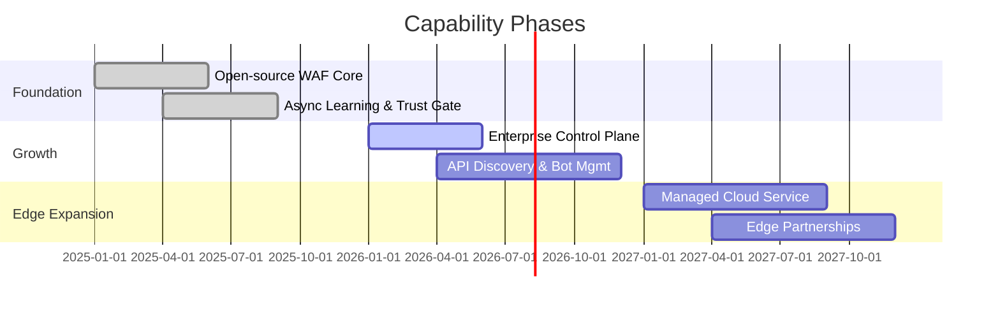
